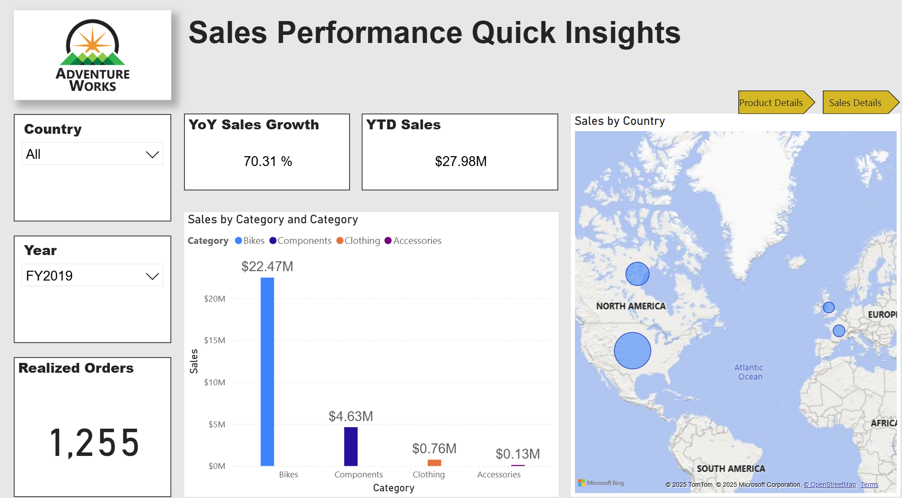

# Hi, I'm Amine Harkane 👋
## Certified BI & Data Analytics Engineer | Microsoft BI Specialist

---

### 👨‍💻 About Me

I'm a data professional specializing in the Microsoft BI Stack, with a strong foundation in data engineering and analytics. I help businesses transform raw data into actionable insights using tools like Power BI, T-SQL, Python, and PySpark. I am Microsoft Certified (PL-300 & DP-203) and passionate about building efficient data pipelines and intuitive dashboards.

- 🔭 I’m currently building end-to-end data projects in Microsoft Fabric.
- 🌱 I’m always learning new data visualization techniques and advanced PySpark.
- 💬 Ask me about: **Power BI, Data Warehousing, SQL Optimization, or Python for data analysis.**

---

### 🛠️ My Tech Stack & Tools

#### BI & Data Visualization

#### Data Engineering & Databases

#### Languages & Libraries

---

### 🏆 Certifications

- [**Microsoft Certified: Data Engineering on Microsoft Azure (DP-203)**](https://learn.microsoft.com/en-us/users/amineharkane-6987/credentials/19a5370ba9092706?ref=https%3A%2F%2Fwww.linkedin.com%2F)
- [**Microsoft Certified: Power BI Data Analyst Associate (PL-300)**](https://learn.microsoft.com/en-us/users/amineharkane-6987/credentials/6fa9f192fce1221c?ref=https%3A%2F%2Fwww.linkedin.com%2F)

---

### 🚀 Featured Projects

Here are some of the projects I've worked on.

#### 1. AdventureWorks Sales Performance Analysis
* **Description:** Developed a comprehensive sales dashboard to analyze seller performance and track key business metrics. Involved cleaning/transforming data, data modeling, and creating KPIs using DAX to empower the sales team.
* **Tech Stack:** `Power BI`, `DAX`, `T-SQL`
* **Links:**
    * [`🔗 View T-SQL Analysis (GitHub)`](https://github.com/HarkaneAmine/SQL/blob/main/T-SQL%20Project.ipynb) 
       <a href="https://app.powerbi.com/view?r=eyJrIjoiMzlhOGMyMGItZjdkNS00NzgwLWJkNmMtNmZkYjVmMTg4NDg0IiwidCI6IjBhNmU5Njk2LWE1ZDktNDFiOS04MDhmLWI4YTQ1YjJhMmI2MyJ9" target="_blank">
    <i>🔗 PowerBI Dashboard (click to interact)</i>
     
    
  </a>

#### 2. Capital Bikeshare Customer Behavior Analysis
* **Description:** Analyzed customer behavior for a bike-sharing company to inform marketing decisions aimed at converting casual riders to members. Used SQL for data cleaning/transformation and Tableau for visualization and route mapping.
* **Tech Stack:** `Tableau`, `SQL`
* **Links:**
    * [`Capital Bikeshare Trips Dashboard`](https://public.tableau.com/app/profile/mohamed.amine.harkane/viz/UrbanBikeSharinginWashingtonDCNeighbourhood/UrbanBikeSharinginWashingtongDCNeighbourhood)

#### 3. Data Warehouse Implementation in Microsoft Fabric
* **Description:** Implemented a sales data warehouse using Microsoft Fabric. This project demonstrates loading, transforming, and storing data within the Fabric ecosystem using T-SQL.
* **Tech Stack:** `Microsoft Fabric`, `T-SQL`, `Data Warehousing`
* **Links:**
    * [`Data Warehouse Implementation & Analytics in Microsoft Fabric Using T-SQL`](https://github.com/HarkaneAmine/SQL/blob/main/topubilishproject/Sales%20Data%20Load%20to%20Warehouse.ipynb)

#### 4. Data Analysis with Pandas
* **Description:** A Jupyter Notebook showcasing various data manipulation, cleaning, and analysis techniques using the Python Pandas library.
* **Tech Stack:** `Python`, `Pandas`, `Jupyter Notebook`
* **Links:**
    * [`Data Analysis using Pandas`](https://github.com/AmineHarkane/Pandas/blob/main/Data%20Analysis%20using%20Pandas.ipynb)

---

### 📊 My GitHub Stats

